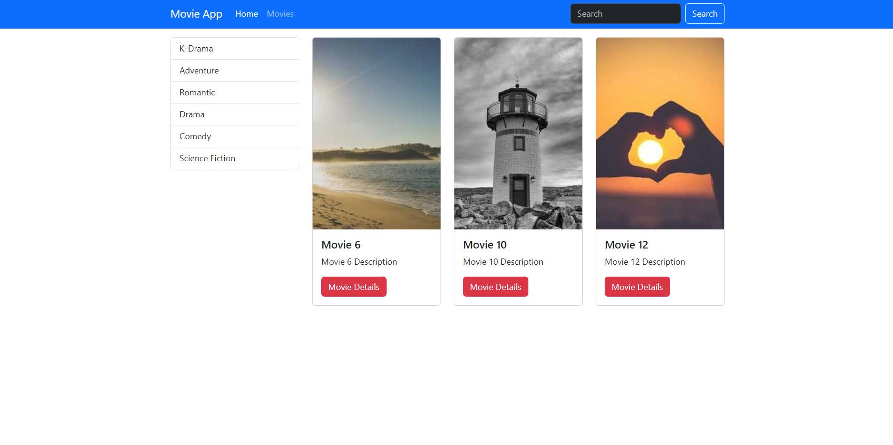
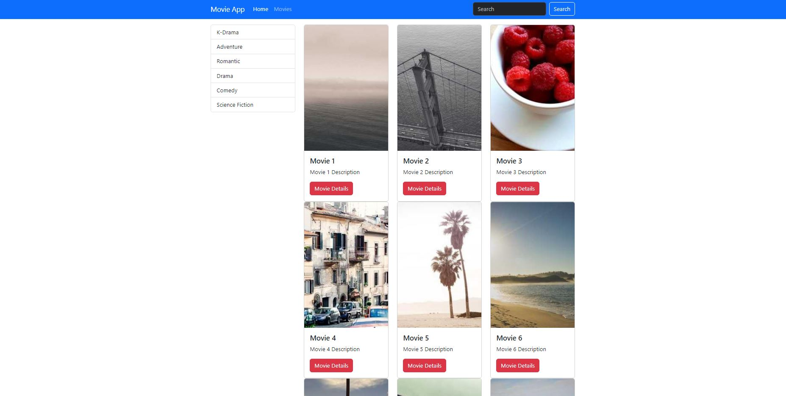

# Movie Application

- **movieapp** created
- **movies** app created
- **urls** created
- **models** created
- **views** created
- **db** checked
- **admin panel** created
- **movies** added from admin panel
- **categories** added from admin panel
- **movie details** added

In this application, I aimed to show basics of Python/Django structure with a simple project. I created the neccesary app and urls to direct user to pages that they want. when you add **/home and /movies** to end of their url, homepage and movies page will be shown and then they can select the movies. Also I've added **Movie Details** section. So user can show details about the movie.

### What could be added to project? 

- Routing urls and categorizing operations could be added.
- Movie API implementation could be added, so users could select thousands of movies that they want. 
- IMDB API implementation could be added, so users could've seen the IMDB details of movie in movie details section.
- Login Page could be added, so users can personalize their favorite movies and categories.
- Search section could be activated so users can find the movie that they are looking for.
- Unit test can be done.

 #### You could see the screenshots of project

 - **Home Page**

 

 - **Movies Page**

 